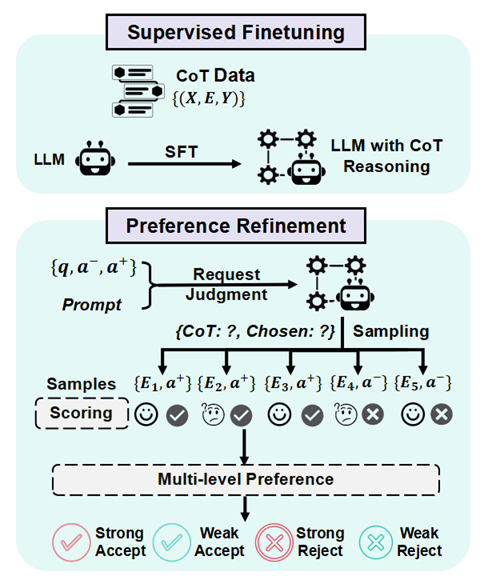
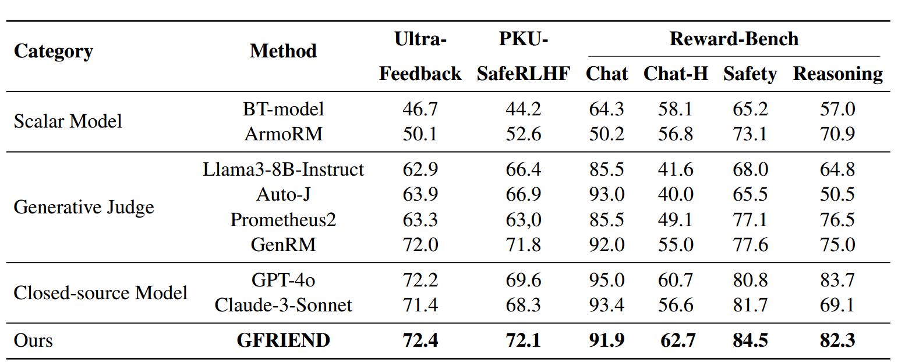
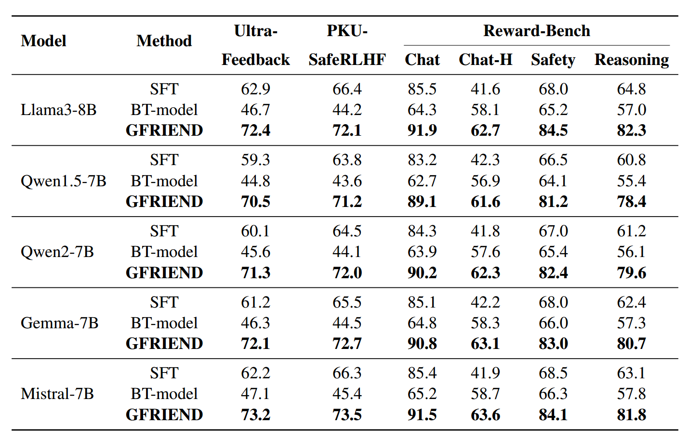
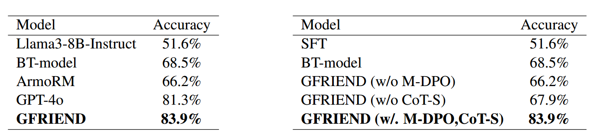

# GFRIEND: Generative Few-shot Reward Inference through Efficient DPO

This is the official implementation of GFRIEND: Generative Few-shot Reward Inference through Efficient DPO. The core process includes:
1. **SFT**: Supervised fine-tuning of the base model using a small amount of (question, chain-of-thought) data to enable it to generate high-quality thoughts/reasoning.
2. **Preference Refinement**: Sampling multiple times on data with preference labels to generate diverse CoT (chain-of-thought) and judgment results, and expanding and fine-grainedly distinguishing preference data based on perplexity scoring.
3. **M-DPO**: Weighted Direct Preference Optimization training on the above multi-level preference data.

  


*Figure 1: The steps for Generating more preference datas with a preference dataset that includes preference labels for a pair of answers to a question.*


## Dataset

The project primarily utilizes the following two types of datasets for training and evaluation as described in the paper:

1. **General Domain Dataset**: We selected the publicly available ["Skywork-Reward-Preference-80K-v0.2"]("Skywork-Reward-Preference-80K-v0.2") as the base preference data. For few-shot scenarios, we used a small number of high-quality samples (approximately 3,000) for experimentation and tested on public benchmarks such as

- [Reward Bench](https://huggingface.co/spaces/allenai/reward-bench) A dataset for evaluating the capabilities of reward models, covering multiple categories including chat, reasoning, and safety, is designed to test the performance of reward models in complex and structured queries.
- [UltraFeedback](https://github.com/OpenBMB/UltraFeedback) A large-scale, fine-grained, and diverse preference dataset, containing prompts from various resources, and annotated by GPT-4 in four aspects: instruction following, authenticity, honesty, and usefulness.
- [PKU-SafeRLHF](https://github.com/PKU-Alignment/safe-rlhf) A human-annotated preference dataset, containing over 300,000 human-labeled comparison data points, covering preferences for usefulness and harmlessness, aimed at promoting research on the safe alignment of large language models.


2. **Medical Domain Dataset**: To verify the effectiveness of the method in specialized scenarios, the paper constructed a medical preference dataset simulating a low-resource environment based on the [iCliniq](https://www.icliniq.com/) dataset. The dataset consists of 3,500 entries, with 3,000 used for training and 500 for validation. The data is derived from anonymized segments of real clinical conversations and publicly available medical data. It has undergone deduplication, normalization, anonymization, and expert annotation to form a structured preference format of (question, answer_pos, answer_neg).

When reproducing or conducting research using the above datasets, please note the following points:

- The preprocessing and filtering methods for the general domain dataset are detailed in the paper and script comments. It is recommended to ensure that there is no overlap between the training and test sets before training.
- If you have other custom preference data (such as for question-answering or dialogue scenarios), you can also integrate it into the same process in the format of (question, answer_neg, answer_pos).

## Experimental Results

### Main Results

 

*Table 1:Accuracy of models’ judges on the test sets of Ultra-Feedback, PKU-SafeRLHF, and Reward-Bench. BT-model, ArmoRM and GFRIEND are trained on 3000 samples of Skywork-Reward-Preference-80K-v0.2 based
on Llama3-8B-Instruct.*

 

*Table 2: Evaluation of different language model bases using supervised fine-tuning (SFT), BTmodel, and the GFRIEND method on the three benchmarks: UltraFeedback, PKU-SafeRLHF and Reward-Bench. With the exception of SFT, the data used to train the model were all 3000 samples.*

 

*Table 3(Left): Judgment accuracy of GFRIEND and other models on specific medical datasets. BT-model, ArmoRM and GFRIEND are trained on 3000 samples based on Llama3-8B-Instruct.*

*Table 4(Right): Judgment accuracy of GFRIEND and its variants. CoT-S indicates whether or not to use Preference Refinement. With the exception of SFT, the models are all trained on 3000 samples based on Llama3-8B-Instruct.*


## Project Structure
- `/data`: Scripts for data loading and processing
- `/models`: Core logic for models, trainers, etc.
- `/generate`: Functions related to generating diverse preference data, including CoT sampling and perplexity calculation
- `/utils`: General utility functions, such as log management
- `/run_sft.py`: Script for running SFT training
- `/run_preference_refinement.py`: Script for generating and scoring multi-level preference data
- `/run_m_dpo.py`: Script for executing multi-level preference weighted DPO training

## Environment Dependencies
- Python 3.8+
- PyTorch >= 1.13
- transformers >= 4.30
- [Optional] accelerate / deepspeed / flash-attention, and other optimization tools

Installation method:
```bash
pip install -r requirements.txt
```

# Quick Start

SFT: Prepare your (question, chain-of-thought) data, adjust the data path in run_sft.py, and run:
```bash
python run_sft.py
```

Preference Refinement: Prepare your (question, a–, a+) preference pairs, then run:
```bash
python run_preference_refinement.py
```

M-DPO: Training with the generated multi-level preference data using a multi-level preference weighted loss.

```bash
python run_m_dpo.py
```


